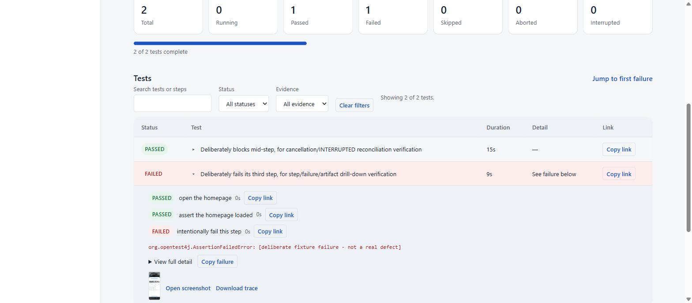
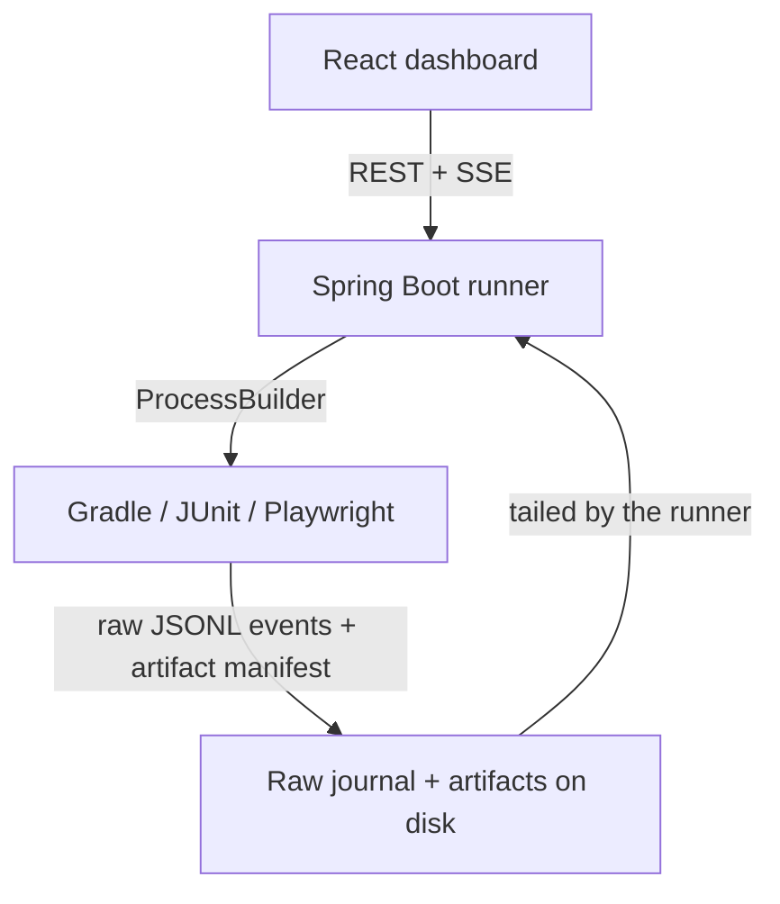

# Playwright Test Runner & Live Dashboard

[](https://openjdk.org/projects/jdk/21/)
[](https://playwright.dev/java/)
[](https://junit.org/)
[](https://spring.io/projects/spring-boot)
[](https://react.dev/)
[](https://nodejs.org/)



A test suite is only as useful as the feedback loop around it. This project starts from a
portfolio-grade Java/Playwright automation suite and builds a real, self-hosted **runner service
and live dashboard** on top of it - so instead of reading a Gradle console or a static HTML report
after the fact, you launch a suite from a web UI and watch it execute test by test, step by step, in
real time, with failures, screenshots, and traces surfacing the moment they happen.

## What it does

- **REST-triggered runs** - pick an environment and suite from an allowlist, launch a real Gradle
  test process through a small Spring Boot service, no SSH/CI-console round trip required.
- **Live progress over Server-Sent Events** - every `RUN_*`/`TEST_*`/`STEP_*` event streams to the
  browser as it happens. Events are synchronously persisted to disk, while reconnect replay uses
  the canonical in-memory history for the lifetime of the current service instance, so a dropped
  connection never loses history mid-run. Restart recovery and journal re-indexing are planned for
  Phase D (see [Current limitations](#current-limitations)).
- **Step-level reporting** - a `Steps` API instrumented directly in the test code reports
  step-by-step progress inside each test, not just a pass/fail at the end - see it live in the
  dashboard's "Live Focus" panel and, after the fact, as a per-test drill-down.
- **Artifacts wired to the exact failure** - a failing step's screenshot and Playwright trace are
  attributed to that step specifically (not just "the test failed somewhere"), downloadable straight
  from the failure it belongs to.
- **Cancellation** - stop a run mid-flight; the active test and step are reconciled to `INTERRUPTED`
  rather than left in a misleading `RUNNING` state forever.
- **Transport recovery** - a dropped SSE connection reconnects and replays cleanly from the last
  acknowledged event; a genuinely gapped stream triggers a full fresh replay instead of silently
  desyncing.

## Architecture



The dashboard never talks to Gradle/JUnit directly - it only ever sees the runner's REST/SSE
surface. Two steps sit between the test process and the dashboard: a JUnit Platform listener and
the `Steps` API write raw test/step JSONL events and an artifact manifest as the suite runs; the
runner tails that raw stream (not log-scraping) and appends each validated event into its own
canonical, sequence-numbered journal, which is what SSE replay is actually served from. See
[Architecture](docs/ARCHITECTURE.md) for the automation suite's own internal lifecycle, and
[`runner-dashboard/README.md`](runner-dashboard/README.md#architecture-current) for the frontend's
state model in more depth.

## Run it locally in 5 minutes

This is the `PUBLIC`/`FIXTURE` fast path, after a one-time browser install. `LOCAL` (below) needs
Git and Docker Desktop with Compose support, and its first local stack build realistically takes
longer than 5 minutes - it fetches and builds the target application from source.

Prerequisites: **JDK 21**, **Node 24** (`runner-dashboard/.nvmrc` pins this).

```bash
./gradlew.bat playwrightInstall   # one-time: installs the Chromium build every run launches
```

**Terminal 1 - backend:**

```bash
./gradlew.bat :runner-service:bootRun
```

**Terminal 2 - dashboard:**

```bash
cd runner-dashboard
npm ci
npm run dev
```

Open `http://localhost:5173/runs`. Two scenarios are available out of the box:

| Environment | Suite | What it does |
|---|---|---|
| `PUBLIC` | `SMOKE` (or any of the other public suites) | Runs against the public read-only [Restful Booker Platform](https://automationintesting.online/) sandbox - nothing extra to set up. |
| `LOCAL` | `JOURNEY` | Runs the same journey suite, including mutation-tagged tests, against a local Docker Compose copy of the same app - safe to write to, never touches the shared public target. Requires Git and Docker Desktop (with Compose). Bring the stack up first: `./gradlew.bat localSutUp && ./gradlew.bat localSutHealth` - the first `localSutUp` fetches and builds the target application from source and is slow (several minutes); later runs are fast. |

Want the failure/artifact drill-down specifically, without waiting on a real defect? Pick the
`FIXTURE` suite under `PUBLIC` - it deliberately fails one step on purpose, on demand, so you can
see the full step/failure/screenshot/trace path immediately. More screenshots of all of this in
[`docs/screenshots/`](docs/screenshots/), or follow the fixed, repeatable
[portfolio demo script](docs/PORTFOLIO_DEMO.md) for a full guided walkthrough.

## Test strategy and CI

The automation suite itself follows a strict, JUnit-extension-enforced tag taxonomy (exactly one
layer, one feature, one effect tag per test - see [Test Strategy](docs/TEST_STRATEGY.md) for the
risk-based reasoning) so a runner or CI pipeline can filter safely without guessing intent from a
test's name. Four GitHub Actions workflows gate this repository, each proven green together on the
same commit as part of this project's own release-candidate process (full detail, run links, and
every acceptance criterion checked in [`docs/RELEASE_CANDIDATE.md`](docs/RELEASE_CANDIDATE.md)):

| Workflow | Gate |
|---|---|
| `quality-gate.yml` | Formatting + the default read-only Java suite, on every push/PR. |
| `dashboard-quality.yml` | Frontend quality (lint, types, coverage, build) + OpenAPI contract drift, on every push/PR. |
| `dashboard-e2e.yml` | The complete real-browser dashboard E2E suite (Playwright, real backend + real dashboard build), weekly + on demand. |
| `local-sut.yml` | Full read-only + mutation regression against the local Docker stack, weekly + on demand. |

The dashboard E2E suite (`dashboardE2eTest`) is the largest dedicated test suite in the repository
(17 test classes, 21 test methods) - real-browser coverage of accessibility (axe-core + a dedicated
keyboard-operability gate), responsive layout at 320/768/1440px, long/unbroken content, a
100-test/400-step synthetic run, and measured render/filter performance, on top of the functional
run-lifecycle/cancel/recovery/deep-link scenarios. See
[`docs/RELEASE_CANDIDATE.md`](docs/RELEASE_CANDIDATE.md)'s acceptance matrix for exactly which test
proves which scenario.

## Current limitations

This is a working release candidate, not a production deployment - the boundaries below are
deliberate scope decisions for this stage, not hidden defects, and Faza D (packaging, persistence,
security, deployment) is where each of them gets addressed:

- **Run history and the artifact/event journal are in-memory and on local disk** - nothing is
  persisted to a database; restarting `runner-service` loses in-flight run state and its history
  list (the raw JSONL event/artifact files on disk survive, but nothing currently re-indexes them
  on startup).
- **Single-instance only** - one `runner-service` process, one in-process run queue. There is no
  clustering, leader election, or horizontal scaling.
- **No authentication or authorization** - anyone who can reach the dashboard/API can launch,
  cancel, and read every run. Fine for a local/demo deployment; not fine exposed on the open
  internet as-is.
- **No artifact retention policy** - screenshots, traces, and logs accumulate under
  `build/runner-artifacts/<runId>/` indefinitely; nothing currently prunes old runs.
- **No deployment packaging yet** - no Dockerfile/image for `runner-service` or the dashboard, no
  same-origin production serving setup. Today this runs as two separate local dev processes (as
  shown above), not a single deployable unit.

## Automation suite

The runner drives the same Java + Playwright + JUnit automation suite this repository started as -
a portfolio-grade UI and API test suite against
[Restful Booker Platform](https://automationintesting.online/), a public Bed & Breakfast application
built for automation practice, with a [public source repo](https://github.com/mwinteringham/restful-booker-platform)
so tests can be based on documented behavior rather than probing an unfamiliar production site.

### What this suite demonstrates

- One Playwright stack for browser and HTTP testing, with a JUnit extension-based lifecycle and
  parameter injection - no generic `BasePage`, page/component objects own their own domain behavior.
- Browser reuse per parallel worker, an isolated browser context per test, no implicit waits.
- Typed API clients and Java records kept separate from test intent; anonymous and
  cookie-authenticated API sessions isolated through Playwright storage state.
- JSON Schema and semantic contract assertions; secret redaction from API evidence and logs.
- Screenshot and Playwright trace capture on UI failure; Allure metadata alongside standard JUnit
  XML/HTML reports.
- A step-reporting API (`Steps`) instrumented directly in test methods, feeding the runner's
  step-level SSE events described above - the same mechanism, used by both the CLI/CI run and the
  live dashboard.
- Read-only default CI with explicitly opt-in tests that mutate the shared public sandbox, guarded
  by a runtime check that refuses to run a mutation test against the shared target unless
  explicitly overridden.

### Quick start (suite only, no dashboard)

```powershell
# Windows PowerShell
./gradlew.bat playwrightInstall
./gradlew.bat test
```

```bash
# macOS / Linux
./gradlew playwrightInstall
./gradlew test
```

Useful suites:

```bash
./gradlew smokeTest       # UI + API critical path
./gradlew regressionTest  # complete read-only regression suite
./gradlew apiTest         # read-only API checks
./gradlew uiTest          # read-only UI checks
./gradlew journeyTest     # read-only cross-layer (API + UI) checks
./gradlew mutationTest    # opt-in write and negative-write checks
./gradlew spotlessCheck   # formatting quality gate
./gradlew allureReport    # static report from existing results
```

The default `test` task excludes the `mutation` tag. This is deliberate: a professional test suite should not silently alter a shared public environment. Every executable test has exactly one effect tag (`read-only` or `mutation`), one layer tag (`api`, `ui`, or `journey`), one feature tag, and `regression`; the JUnit extension fails fast when that taxonomy is violated. As a second line of defense, the extension also refuses to run any `mutation`-tagged test against the configured shared target (see `sharedTargetBaseUrl` below) unless `allowMutationAgainstSharedTarget` is explicitly set.

### Local Docker target

`mutationTest` and the shared-target guard above exist because the default target is a public, shared sandbox. For unrestricted write/mutation testing, `infra/rbp/` runs the same [Restful Booker Platform](https://github.com/mwinteringham/restful-booker-platform) application locally via Docker Compose, pinned to a fixed upstream commit:

```bash
./gradlew.bat localSutUp       # fetch pinned source, build the 6 Java services + assets, start all 7 containers
./gradlew.bat localSutHealth   # wait for every service's health endpoint (no fixed blind startup delay)
./gradlew.bat localTest        # run the full regression suite, including mutation, against localhost
./gradlew.bat localSutDown     # stop the stack
./gradlew.bat localSutReset    # stop the stack and remove its containers/volumes
./gradlew.bat stabilityTest    # rerun localTest N times (-PstabilityRuns=N, default 10) to check determinism
```

Requires Docker Desktop (with Compose) and `git`; no other toolchain needs to be installed on the host — the Java build runs inside a throwaway Maven container. `localSutPrepare` applies a small local patch on top of the pinned upstream source to fix a build-time env var ordering bug in the `assets` service's own Dockerfile (details, including why it's a patch and not a fork, in `infra/rbp/README.md`).

The current `localTest` suite passes 32/32 tests. The earlier automation-foundation stability gate verified the then-current 27-test suite across 10 consecutive `stabilityTest` runs - see [`docs/RELEASE_EVIDENCE.md`](docs/RELEASE_EVIDENCE.md) for that historical record.

### Dashboard end-to-end tests

`dashboardE2eTest` proves the `runner-service` and `runner-dashboard` actually work together, end to end, through a real headless Chromium - not just their own unit/component suites in isolation.

```bash
./gradlew.bat dashboardE2eTest   # one command: builds everything it needs and runs the complete suite
```

That single command already depends on everything else it needs — `:runner-service:bootJar` and `dashboardBuild` (the dashboard's production bundle, built once via `npm run build` and cached by normal Gradle up-to-date checking) — so no separate build step is required. `dashboardBuild` can still be run on its own (`./gradlew.bat dashboardBuild`) to just produce/refresh `runner-dashboard/dist` without running any tests.

Prerequisites beyond the base [Quick start](#quick-start-suite-only-no-dashboard) ones: Node 24 (see `runner-dashboard/.nvmrc`) and npm on `PATH`, and the Chromium browser installed via `./gradlew.bat playwrightInstall` (the same Playwright browser cache the main suite uses — no separate install step).

Where results land:

| What | Where |
|---|---|
| JUnit HTML report | `build/reports/tests/dashboardE2eTest/` |
| JUnit XML | `build/test-results/dashboardE2eTest/` |
| Failure evidence (screenshot, Playwright trace, video) | `build/dashboard-e2e-failures/<TestClass>-<method>/`, one directory per failed test only |
| `runner-service`/`runner-dashboard` stdout/stderr | `build/dashboard-e2e-logs/<name>.log` — always written, not just on failure |

Every test gets a Playwright trace and video running the whole time, but only a **failed** test's are actually kept — open `trace.zip` with `npx playwright show-trace` for a timeline replay of exactly what the browser saw.

### Configuration

System properties take precedence over environment variables.

| Purpose | System property | Environment variable | Default |
|---|---|---|---|
| Target URL | `baseUrl` | `BASE_URL` | `https://automationintesting.online` |
| Browser | `browser` | `BROWSER` | `chromium` |
| Headless | `headless` | `HEADLESS` | `true` |
| Action timeout | `actionTimeoutMs` | `ACTION_TIMEOUT_MS` | `10000` |
| Navigation/API timeout | `navigationTimeoutMs` | `NAVIGATION_TIMEOUT_MS` | `30000` |
| Tracing | `tracing` | `TRACING` | `true` |
| Video | `recordVideo` | `RECORD_VIDEO` | `false` |
| Artifact directory | `artifactsDir` | `ARTIFACTS_DIR` | `build/artifacts` |
| Admin username | `adminUsername` | `ADMIN_USERNAME` | `admin` |
| Admin password | `adminPassword` | `ADMIN_PASSWORD` | `password` |
| Shared target guarded against mutation | `sharedTargetBaseUrl` | `SHARED_TARGET_BASE_URL` | `https://automationintesting.online` |
| Opt in to mutating the shared target | `allowMutationAgainstSharedTarget` | `ALLOW_MUTATION_AGAINST_SHARED_TARGET` | `false` |

The checked-in defaults are the demo credentials published by the application owners. For any non-demo environment, pass credentials through CI secrets.

Example cross-browser run:

```bash
./gradlew playwrightInstall -Pbrowser=firefox
./gradlew uiTest -Dbrowser=firefox -Dheadless=false
```

### Project structure

```text
src/test/java/dev/vlaisanem/automation
├── api/          HTTP clients, evidence capture, response abstraction
├── config/       validated environment/system-property configuration
├── core/         JUnit extension, Playwright lifecycle, and the Steps API
├── data/         isolated test-data factories
├── model/        immutable API contracts
├── support/      JSON, redaction, and schema validation
├── tests/        API, UI, journey, and opt-in mutation checks
└── ui/           page and component objects

runner-contract/    shared event/artifact schema (Java records) used by both the suite and the runner
runner-listener/    JUnit ServiceLoader listener that writes the JSONL event journal
runner-service/     Spring Boot REST + SSE backend that launches Gradle and tails that journal
runner-dashboard/   React/Vite frontend
```

Framework code lives in the test source set because this repository is an executable test product, not a library shipped to production. There is intentionally no generic `BasePage`: page/component objects expose domain behavior and keep assertions close to the contract they understand.

See [Architecture](docs/ARCHITECTURE.md), [Test Strategy](docs/TEST_STRATEGY.md), and [Contributing](CONTRIBUTING.md) for the engineering rationale and roadmap.

### Current executable coverage

| Layer | Check | Default run |
|---|---|---|
| API | Admin authentication returns a usable token | Yes |
| API contract | Room inventory matches JSON Schema and domain rules | Yes |
| API | Anonymous guests cannot read or list bookings | Yes |
| API | Anonymous guests can read and list every contact message (documented access-control gap) | Yes |
| API | Anonymous guests cannot update/delete a test-owned booking; invalid bookings are rejected | No, `mutation` opt-in |
| API | Invalid date ranges and overlaps are rejected; adjacent stays are accepted; the known past-date gap is characterized | No, `mutation` opt-in |
| API | Contact message validation rejects blank, malformed, and out-of-range fields | No, `mutation` opt-in on the shared target |
| UI | Guest can load the home page and discover bookable rooms | Yes |
| UI | Admin login succeeds with valid credentials and reports an error with invalid ones | Yes |
| Journey | The homepage renders the first three API rooms as booking actions, in order | Yes |
| API CRUD | Admin creates, reads, updates, and deletes an isolated room | No, `mutation` opt-in |
| API CRUD | Admin creates, reads, updates, and deletes an isolated booking | No, `mutation` opt-in |
| API | Guest submits a valid contact message | No, `mutation` opt-in (no delete endpoint exists) |
| UI journey | Guest completes a booking end to end and it is cleaned up afterward | No, `mutation` opt-in |
| UI | Guest submits the contact form and the API accepts it | No, `mutation` opt-in (no delete endpoint exists) |

The explicit layer, feature, suite, and effect tags allow the runner to discover and safely filter tests without depending on Allure metadata or interpreting the absence of a tag.

This is a strong foundation, not a claim of exhaustive coverage. The next valuable additions are OpenAPI-driven contract checks against the application under test itself and timezone-focused booking cases.

### Known application issues found by this suite

The contact form's "Message" `<label>` targets a `for="message"` id that the rendered `<textarea>` does not have (its real id is `description`), so the field has no accessible name. `ContactForm` works around this with a `data-testid` locator (`getByTestId("ContactDescription")`), per the locator policy in [Contributing](CONTRIBUTING.md). This is a real accessibility gap in the application, not a framework bug.

The booking API currently accepts stays dated entirely in the past. The opt-in date-rules suite records this as a `known-defect` characterization test, while invalid ranges, zero-night stays, overlaps, and adjacent boundaries assert their observed contracts normally.

The message API has no authorization check on any read endpoint: `GET /api/message` and `GET /api/message/{id}` return full data, including a guest's email and phone number, to a fully anonymous caller. `MessageAuthorizationApiTest` records this as a `known-defect` characterization test, mirroring how `BookingAuthorizationApiTest` documents the (correct) equivalent behavior for bookings.

### Build tooling backlog

Any build (e.g. `./gradlew help --warning-mode all`) prints three deprecation warnings scheduled for removal in Gradle 10: Kotlin DSL delegated-property syntax (`by creating`/`by registering`) and a `Project` object used as a dependency notation. This repo's own build files are plain Groovy DSL (`build.gradle`, `settings.gradle`) and use none of these patterns — the warnings originate inside an applied plugin's internals (`com.diffplug.spotless:8.10.0` and/or `io.qameta.allure:4.1.0`), not in code we own, so there is nothing to fix here directly. Re-run `--warning-mode all` after the next spotless/allure plugin version bump to check whether upstream has cleared them; if they persist once we're actually on Gradle 10, that's when this becomes a real blocker rather than a backlog note.
