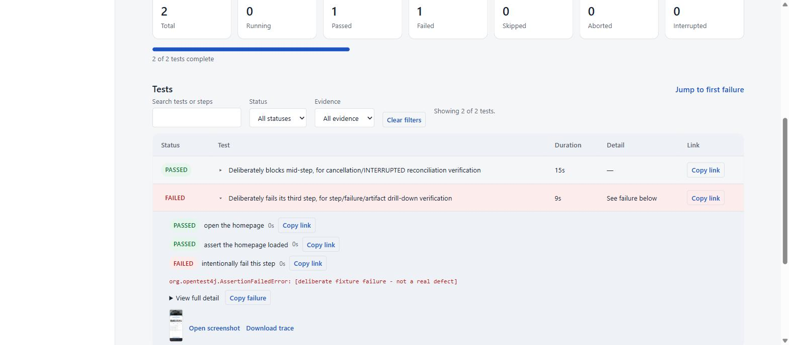
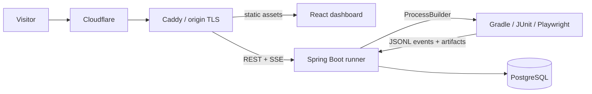

# Playwright Automation Platform

[](https://automation.vlaisavljevic.dev)
[](https://github.com/NemanjaVlaisavljevic/playwright-automation-framework/actions/workflows/quality-gate.yml)
[](https://github.com/NemanjaVlaisavljevic/playwright-automation-framework/actions/workflows/dashboard-quality.yml)
[](https://openjdk.org/projects/jdk/21/)
[](https://playwright.dev/java/)
[](https://spring.io/projects/spring-boot)
[](https://react.dev/)
[](https://www.postgresql.org/)

**A production-deployed test execution platform built around Java, Playwright, Spring Boot,
React, and PostgreSQL.** Launch an allowlisted suite from the browser and follow every test and
step in real time, with durable event replay and failure evidence attached to the exact step that
produced it.

> **Live dashboard:** [automation.vlaisavljevic.dev](https://automation.vlaisavljevic.dev)
>
> Run history, results, progress, logs, and artifacts are public to inspect. Launching or cancelling
> a run is deliberately restricted to the repository owner's allowlisted GitHub account.

[Local demo script](docs/PORTFOLIO_DEMO.md) ·
[System architecture](docs/ARCHITECTURE.md) ·
[Deployment architecture](docs/DEPLOYMENT_ARCHITECTURE.md) ·
[Operations runbook](docs/RUNBOOK.md) ·
[Release evidence](docs/RELEASE_EVIDENCE.md)



## Why this project

This is more than a browser test repository with a generated report. It treats test execution as a
small production system and makes the engineering around the tests visible:

| Concern | Implementation |
|---|---|
| Automation | Java 21, Playwright, JUnit 6, API/UI/journey coverage, enforced risk and effect tags |
| Control plane | Spring Boot REST API, allowlisted suites, bounded queue, cancellation, process-tree cleanup |
| Live reporting | Server-Sent Events with sequence numbers, replay, reconnect recovery, test- and step-level progress |
| Diagnostics | Screenshots, Playwright traces, logs, and artifacts linked to the precise failing test step |
| Persistence | PostgreSQL 17, Flyway migrations, transactional event history, startup recovery, automatic retention |
| Security | GitHub OAuth2 numeric-ID allowlist, CSRF protection, rate limits, request-size bounds, strict security headers |
| Frontend | React 19, TypeScript, Vite, generated OpenAPI client, responsive and accessibility-tested UI |
| Operations | Docker Compose, Caddy-managed TLS, Cloudflare proxy, health checks, isolated networks, restart-safe services |

## Architecture


```mermaid
flowchart LR
    V["Visitor"] --> CF["Cloudflare"]
    CF --> C["Caddy / origin TLS"]
    C -->|"static assets"| UI["React dashboard"]
    C -->|"REST + SSE"| R["Spring Boot runner"]
    R -->|"ProcessBuilder"| T["Gradle / JUnit / Playwright"]
    T -->|"JSONL events + artifacts"| R
    R --> P[("PostgreSQL")]
```

Only Caddy publishes host ports (`80`/`443`). The runner and PostgreSQL stay on private Compose
networks; PostgreSQL is additionally isolated on an internal data network that the web container
cannot join. The live deployment uses a valid origin certificate with Cloudflare **Full (strict)**
TLS, while Caddy applies the application routing and security headers.

The dashboard never talks to Gradle or JUnit directly. A JUnit Platform listener and the `Steps`
API write structured test/step events and an artifact manifest as the suite runs. The runner tails
that stream (not console-log scraping), validates it, persists a canonical sequence-numbered event
history, and serves both the live SSE feed and reconnect replay from that same history.

## Core capabilities

- **Browser-launched runs** - select a safe environment and suite and launch the real Gradle test
  process through the REST control plane, with no SSH or CI-console round trip.
- **Durable live progress** - `RUN_*`, `TEST_*`, and `STEP_*` events stream to the browser as they
  happen and are committed to PostgreSQL before delivery. Reconnects replay from the last event;
  a sequence gap triggers a clean full replay instead of silently desynchronizing.
- **Restart recovery** - a run left `QUEUED`, `STARTING`, or `RUNNING` during a service restart is
  reconciled to a terminal `ERROR` state before new work is accepted.
- **Step-level diagnostics** - failure screenshots and Playwright traces belong to the specific
  step that failed, and are directly downloadable from that step's result.
- **Safe cancellation** - cancelling a live process reconciles the active test and step to
  `INTERRUPTED` instead of leaving misleading in-progress state behind.
- **Public evidence, protected mutations** - anonymous visitors can inspect the portfolio; only a
  GitHub numeric-ID allowlisted administrator can launch or cancel runs. OAuth tokens remain on the
  server and never reach browser JavaScript.
- **Bounded operation** - per-surface rate limits, queue limits, artifact/process-log limits, health
  checks, and crash-safe age/count retention keep a single-node portfolio deployment predictable.

## Run it locally in 5 minutes

This is the `PUBLIC`/`FIXTURE` fast path, after a one-time browser install. `LOCAL` (below) needs
Git and Docker Desktop with Compose support, and its first local stack build realistically takes
longer than 5 minutes - it fetches and builds the target application from source.

Prerequisites: **JDK 21**, **Node 24** (`runner-dashboard/.nvmrc` pins this), **Docker** (for the
local Postgres `runner-service` now persists run/event history to - see below).

```bash
./gradlew.bat playwrightInstall   # one-time: installs the Chromium build every run launches
./gradlew.bat :runner-service:localPostgresUp   # one-time per session: starts a local Postgres on :5433
```

**Terminal 1 - backend:**

```bash
./gradlew.bat :runner-service:bootRun
```

**Terminal 2 - dashboard:**

```bash
cd runner-dashboard
npm ci
npm run dev
```

Open `http://localhost:5173/runs`. Two scenarios are available out of the box:

| Environment | Suite | What it does |
|---|---|---|
| `PUBLIC` | `SMOKE` (or any of the other public suites) | Runs against the public read-only [Restful Booker Platform](https://automationintesting.online/) sandbox - nothing extra to set up. |
| `LOCAL` | `JOURNEY` | Runs the same journey suite, including mutation-tagged tests, against a local Docker Compose copy of the same app - safe to write to, never touches the shared public target. Requires Git and Docker Desktop (with Compose). Bring the stack up first: `./gradlew.bat localSutUp && ./gradlew.bat localSutHealth` - the first `localSutUp` fetches and builds the target application from source and is slow (several minutes); later runs are fast. |

Want the failure/artifact drill-down specifically, without waiting on a real defect? Pick the
`FIXTURE` suite under `PUBLIC` - it deliberately fails one step on purpose, on demand, so you can
see the full step/failure/screenshot/trace path immediately. More screenshots of all of this in
[`docs/screenshots/`](docs/screenshots/), or follow the fixed, repeatable
[portfolio demo script](docs/PORTFOLIO_DEMO.md) for a full guided walkthrough.

## Test strategy and CI

The automation suite itself follows a strict, JUnit-extension-enforced tag taxonomy (exactly one
layer, one feature, one effect tag per test - see [Test Strategy](docs/TEST_STRATEGY.md) for the
risk-based reasoning) so a runner or CI pipeline can filter safely without guessing intent from a
test's name. Five GitHub Actions workflows cover fast pull-request gates, real-browser integration,
the writable local target, and load testing. Full run links and acceptance evidence live in
[`docs/RELEASE_CANDIDATE.md`](docs/RELEASE_CANDIDATE.md):

| Workflow | Gate |
|---|---|
| `quality-gate.yml` | Formatting + the default read-only Java suite, on every push/PR. |
| `dashboard-quality.yml` | Frontend quality (lint, types, coverage, build) + OpenAPI contract drift, on every push/PR. |
| `dashboard-e2e.yml` | The complete real-browser dashboard E2E suite (Playwright, real backend + real dashboard build), weekly + on demand. |
| `local-sut.yml` | Full read-only + mutation regression against the local Docker stack, weekly + on demand. |
| `performance-test.yml` | Blocking k6 correctness and latency thresholds against the production-policy topology, on demand. |

The dashboard E2E suite (`dashboardE2eTest`) is the largest dedicated test suite in the repository
(17 test classes, 21 test methods) - real-browser coverage of accessibility (axe-core + a dedicated
keyboard-operability gate), responsive layout at 320/768/1440px, long/unbroken content, a
100-test/400-step synthetic run, and measured render/filter performance, on top of the functional
run-lifecycle/cancel/recovery/deep-link scenarios. See
[`docs/RELEASE_CANDIDATE.md`](docs/RELEASE_CANDIDATE.md)'s acceptance matrix for exactly which test
proves which scenario.

## Scope and trade-offs

- **Single-instance by design** - one runner process and one bounded in-process queue; no clustering,
  leader election, or horizontal scaling is claimed for this portfolio workload.
- **Production runs are read-only** - the live `PORTFOLIO` profile exposes only the shared public
  target and refuses local/mutation execution. Writable journey coverage runs against the isolated
  seven-container local target in CI.
- **Artifacts are local and disposable** - metadata is durable in PostgreSQL, while screenshots,
  traces, and logs stay on the runner volume and expire after 14 days. Run history expires after
  30 days or 500 terminal runs, whichever bound is reached first.
- **No off-site backup for the live demo** - its run history is reproducible evidence rather than
  business or user data. The repository includes and tests an encrypted PostgreSQL backup/restore
  path, but the portfolio deployment intentionally accepts rebuilding its small history after a
  host loss.
- **External sandbox dependency** - public suites exercise the shared Restful Booker Platform demo,
  so an upstream outage or behavior change can affect a run even when this platform is healthy.

## Automation suite

The runner drives the same Java + Playwright + JUnit automation suite this repository started as -
a portfolio-grade UI and API test suite against
[Restful Booker Platform](https://automationintesting.online/), a public Bed & Breakfast application
built for automation practice, with a [public source repo](https://github.com/mwinteringham/restful-booker-platform)
so tests can be based on documented behavior rather than probing an unfamiliar production site.

### What this suite demonstrates

- One Playwright stack for browser and HTTP testing, with a JUnit extension-based lifecycle and
  parameter injection - no generic `BasePage`, page/component objects own their own domain behavior.
- Browser reuse per parallel worker, an isolated browser context per test, no implicit waits.
- Typed API clients and Java records kept separate from test intent; anonymous and
  cookie-authenticated API sessions isolated through Playwright storage state.
- JSON Schema and semantic contract assertions; secret redaction from API evidence and logs.
- Screenshot and Playwright trace capture on UI failure; Allure metadata alongside standard JUnit
  XML/HTML reports.
- A step-reporting API (`Steps`) instrumented directly in test methods, feeding the runner's
  step-level SSE events described above - the same mechanism, used by both the CLI/CI run and the
  live dashboard.
- Read-only default CI with explicitly opt-in tests that mutate the shared public sandbox, guarded
  by a runtime check that refuses to run a mutation test against the shared target unless
  explicitly overridden.

### Quick start (suite only, no dashboard)

```powershell
# Windows PowerShell
./gradlew.bat playwrightInstall
./gradlew.bat test
```

```bash
# macOS / Linux
./gradlew playwrightInstall
./gradlew test
```

Useful suites:

```bash
./gradlew smokeTest       # UI + API critical path
./gradlew regressionTest  # complete read-only regression suite
./gradlew apiTest         # read-only API checks
./gradlew uiTest          # read-only UI checks
./gradlew journeyTest     # read-only cross-layer (API + UI) checks
./gradlew mutationTest    # opt-in write and negative-write checks
./gradlew spotlessCheck   # formatting quality gate
./gradlew allureReport    # static report from existing results
```

The default `test` task excludes the `mutation` tag. This is deliberate: a professional test suite should not silently alter a shared public environment. Every executable test has exactly one effect tag (`read-only` or `mutation`), one layer tag (`api`, `ui`, or `journey`), one feature tag, and `regression`; the JUnit extension fails fast when that taxonomy is violated. As a second line of defense, the extension also refuses to run any `mutation`-tagged test against the configured shared target (see `sharedTargetBaseUrl` below) unless `allowMutationAgainstSharedTarget` is explicitly set.

### Local Docker target

`mutationTest` and the shared-target guard above exist because the default target is a public, shared sandbox. For unrestricted write/mutation testing, `infra/rbp/` runs the same [Restful Booker Platform](https://github.com/mwinteringham/restful-booker-platform) application locally via Docker Compose, pinned to a fixed upstream commit:

```bash
./gradlew.bat localSutUp       # fetch pinned source, build the 6 Java services + assets, start all 7 containers
./gradlew.bat localSutHealth   # wait for every service's health endpoint (no fixed blind startup delay)
./gradlew.bat localTest        # run the full regression suite, including mutation, against localhost
./gradlew.bat localSutDown     # stop the stack
./gradlew.bat localSutReset    # stop the stack and remove its containers/volumes
./gradlew.bat stabilityTest    # rerun localTest N times (-PstabilityRuns=N, default 10) to check determinism
```

Requires Docker Desktop (with Compose) and `git`; no other toolchain needs to be installed on the host — the Java build runs inside a throwaway Maven container. `localSutPrepare` applies a small local patch on top of the pinned upstream source to fix a build-time env var ordering bug in the `assets` service's own Dockerfile (details, including why it's a patch and not a fork, in `infra/rbp/README.md`).

The current `localTest` suite passes 32/32 tests. The earlier automation-foundation stability gate verified the then-current 27-test suite across 10 consecutive `stabilityTest` runs - see [`docs/RELEASE_EVIDENCE.md`](docs/RELEASE_EVIDENCE.md) for that historical record.

### Dashboard end-to-end tests

`dashboardE2eTest` proves the `runner-service` and `runner-dashboard` actually work together, end to end, through a real headless Chromium - not just their own unit/component suites in isolation.

```bash
./gradlew.bat dashboardE2eTest   # one command: builds everything it needs and runs the complete suite
```

That single command already depends on everything else it needs — `:runner-service:bootJar` and `dashboardBuild` (the dashboard's production bundle, built once via `npm run build` and cached by normal Gradle up-to-date checking) — so no separate build step is required. `dashboardBuild` can still be run on its own (`./gradlew.bat dashboardBuild`) to just produce/refresh `runner-dashboard/dist` without running any tests.

Prerequisites beyond the base [Quick start](#quick-start-suite-only-no-dashboard) ones: Node 24 (see `runner-dashboard/.nvmrc`) and npm on `PATH`, and the Chromium browser installed via `./gradlew.bat playwrightInstall` (the same Playwright browser cache the main suite uses — no separate install step).

Where results land:

| What | Where |
|---|---|
| JUnit HTML report | `build/reports/tests/dashboardE2eTest/` |
| JUnit XML | `build/test-results/dashboardE2eTest/` |
| Failure evidence (screenshot, Playwright trace, video) | `build/dashboard-e2e-failures/<TestClass>-<method>/`, one directory per failed test only |
| `runner-service`/`runner-dashboard` stdout/stderr | `build/dashboard-e2e-logs/<name>.log` — always written, not just on failure |

Every test gets a Playwright trace and video running the whole time, but only a **failed** test's are actually kept — open `trace.zip` with `npx playwright show-trace` for a timeline replay of exactly what the browser saw.

### Database integration tests

`databaseIntegrationTest` proves `runner-service`'s Flyway-managed PostgreSQL schema (see [`docs/DEPLOYMENT_ARCHITECTURE.md`](docs/DEPLOYMENT_ARCHITECTURE.md)) against a real database, not a compatible-looking stand-in — every test runs against a real `postgres` Docker image via [Testcontainers](https://testcontainers.com/), never H2 (H2 can't faithfully emulate `jsonb` or PostgreSQL's own row-locking semantics, both load-bearing for this schema's replay-atomicity protocol).

```bash
./gradlew.bat :runner-service:databaseIntegrationTest
```

Requires Docker — the same requirement `dashboardE2eTest`'s underlying tooling has, nothing extra to install. A separate Gradle source set/task from `runner-service`'s ordinary `test`, on purpose: keeps that fast, Docker-free default suite unchanged while still giving CI (`quality-gate.yml`) its own real, separately-visible signal for what actually exercised the database schema/protocol.

Where results land: JUnit HTML report at `runner-service/build/reports/tests/databaseIntegrationTest/`, JUnit XML at `runner-service/build/test-results/databaseIntegrationTest/`.

`RunnerServiceApplication` itself depends on a real Postgres too — every `bootRun`/`dashboardE2eTest` invocation, not just `databaseIntegrationTest`. `./gradlew.bat :runner-service:localPostgresUp`/`localPostgresDown` manage a throwaway `postgres:17-alpine` container on `localhost:5433` for local `bootRun` (see that task's own comment in `runner-service/build.gradle` for why 5433, not 5432); `dashboardE2eTest` provisions its own Testcontainers Postgres automatically, nothing to start by hand. The real `deploy/docker-compose.yml` deployment points `runner-service` at its sibling `postgres` service instead of either of these.

### Configuration

System properties take precedence over environment variables.

| Purpose | System property | Environment variable | Default |
|---|---|---|---|
| Target URL | `baseUrl` | `BASE_URL` | `https://automationintesting.online` |
| Browser | `browser` | `BROWSER` | `chromium` |
| Headless | `headless` | `HEADLESS` | `true` |
| Action timeout | `actionTimeoutMs` | `ACTION_TIMEOUT_MS` | `10000` |
| Navigation/API timeout | `navigationTimeoutMs` | `NAVIGATION_TIMEOUT_MS` | `30000` |
| Tracing | `tracing` | `TRACING` | `true` |
| Video | `recordVideo` | `RECORD_VIDEO` | `false` |
| Artifact directory | `artifactsDir` | `ARTIFACTS_DIR` | `build/artifacts` |
| Admin username | `adminUsername` | `ADMIN_USERNAME` | `admin` |
| Admin password | `adminPassword` | `ADMIN_PASSWORD` | `password` |
| Shared target guarded against mutation | `sharedTargetBaseUrl` | `SHARED_TARGET_BASE_URL` | `https://automationintesting.online` |
| Opt in to mutating the shared target | `allowMutationAgainstSharedTarget` | `ALLOW_MUTATION_AGAINST_SHARED_TARGET` | `false` |

The checked-in defaults are the demo credentials published by the application owners. For any non-demo environment, pass credentials through CI secrets.

Example cross-browser run:

```bash
./gradlew playwrightInstall -Pbrowser=firefox
./gradlew uiTest -Dbrowser=firefox -Dheadless=false
```

### Project structure

```text
src/test/java/dev/vlaisanem/automation
├── api/          HTTP clients, evidence capture, response abstraction
├── config/       validated environment/system-property configuration
├── core/         JUnit extension, Playwright lifecycle, and the Steps API
├── data/         isolated test-data factories
├── model/        immutable API contracts
├── support/      JSON, redaction, and schema validation
├── tests/        API, UI, journey, and opt-in mutation checks
└── ui/           page and component objects

runner-contract/    shared event/artifact schema (Java records) used by both the suite and the runner
runner-listener/    JUnit ServiceLoader listener that writes the JSONL event journal
runner-service/     Spring Boot REST + SSE backend that launches Gradle and tails that journal
runner-dashboard/   React/Vite frontend
```

Framework code lives in the test source set because this repository is an executable test product, not a library shipped to production. There is intentionally no generic `BasePage`: page/component objects expose domain behavior and keep assertions close to the contract they understand.

See [Architecture](docs/ARCHITECTURE.md), [Test Strategy](docs/TEST_STRATEGY.md), and [Contributing](CONTRIBUTING.md) for the engineering rationale and roadmap.

### Current executable coverage

| Layer | Check | Default run |
|---|---|---|
| API | Admin authentication returns a usable token | Yes |
| API contract | Room inventory matches JSON Schema and domain rules | Yes |
| API | Anonymous guests cannot read or list bookings | Yes |
| API | Anonymous guests can read and list every contact message (documented access-control gap) | Yes |
| API | Anonymous guests cannot update/delete a test-owned booking; invalid bookings are rejected | No, `mutation` opt-in |
| API | Invalid date ranges and overlaps are rejected; adjacent stays are accepted; the known past-date gap is characterized | No, `mutation` opt-in |
| API | Contact message validation rejects blank, malformed, and out-of-range fields | No, `mutation` opt-in on the shared target |
| UI | Guest can load the home page and discover bookable rooms | Yes |
| UI | Admin login succeeds with valid credentials and reports an error with invalid ones | Yes |
| Journey | The homepage renders the first three API rooms as booking actions, in order | Yes |
| API CRUD | Admin creates, reads, updates, and deletes an isolated room | No, `mutation` opt-in |
| API CRUD | Admin creates, reads, updates, and deletes an isolated booking | No, `mutation` opt-in |
| API | Guest submits a valid contact message | No, `mutation` opt-in (no delete endpoint exists) |
| UI journey | Guest completes a booking end to end and it is cleaned up afterward | No, `mutation` opt-in |
| UI | Guest submits the contact form and the API accepts it | No, `mutation` opt-in (no delete endpoint exists) |

The explicit layer, feature, suite, and effect tags allow the runner to discover and safely filter tests without depending on Allure metadata or interpreting the absence of a tag.

This is a strong foundation, not a claim of exhaustive coverage. The next valuable additions are OpenAPI-driven contract checks against the application under test itself and timezone-focused booking cases.

### Known application issues found by this suite

The contact form's "Message" `<label>` targets a `for="message"` id that the rendered `<textarea>` does not have (its real id is `description`), so the field has no accessible name. `ContactForm` works around this with a `data-testid` locator (`getByTestId("ContactDescription")`), per the locator policy in [Contributing](CONTRIBUTING.md). This is a real accessibility gap in the application, not a framework bug.

The booking API currently accepts stays dated entirely in the past. The opt-in date-rules suite records this as a `known-defect` characterization test, while invalid ranges, zero-night stays, overlaps, and adjacent boundaries assert their observed contracts normally.

The message API has no authorization check on any read endpoint: `GET /api/message` and `GET /api/message/{id}` return full data, including a guest's email and phone number, to a fully anonymous caller. `MessageAuthorizationApiTest` records this as a `known-defect` characterization test, mirroring how `BookingAuthorizationApiTest` documents the (correct) equivalent behavior for bookings.

### Build tooling backlog

Any build (e.g. `./gradlew help --warning-mode all`) prints three deprecation warnings scheduled for removal in Gradle 10: Kotlin DSL delegated-property syntax (`by creating`/`by registering`) and a `Project` object used as a dependency notation. This repo's own build files are plain Groovy DSL (`build.gradle`, `settings.gradle`) and use none of these patterns — the warnings originate inside an applied plugin's internals (`com.diffplug.spotless:8.10.0` and/or `io.qameta.allure:4.1.0`), not in code we own, so there is nothing to fix here directly. Re-run `--warning-mode all` after the next spotless/allure plugin version bump to check whether upstream has cleared them; if they persist once we're actually on Gradle 10, that's when this becomes a real blocker rather than a backlog note.
