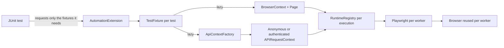

# Architecture

## Design goals

The framework optimizes for isolation, diagnosability, clear ownership, and safe parallel execution. Test code should describe risk and behavior; infrastructure code should own browsers, HTTP contexts, configuration, artifacts, and cleanup.

## Lifecycle

1. `AutomationExtension` creates a `TestFixture` in the JUnit extension store.
2. A `Page`, `BrowserContext`, `APIRequestContext`, `ApiContextFactory`, or `TestConfig` is created only if the test asks for it.
3. Each parallel worker owns its Playwright runtime. API-only tests do not launch a browser.
4. UI tests receive a fresh browser context and page, preventing cookie, cache, and storage leakage.
5. Authenticated API calls use a separate storage-state-backed request context, preventing session leakage between tests.
6. A failed UI test captures a full-page screenshot and Playwright trace before teardown.
7. JUnit closes per-test fixtures and the execution-level runtime registry through `AutoCloseable` store resources.

## Package responsibilities

- `core`: lifecycle only; it has no application-specific selectors or endpoints.
- `config`: typed and validated runtime choices.
- `api`: transport and service clients. Tests retain assertion ownership.
- `model`: immutable wire/domain records.
- `ui`: page and smaller component objects built around user-visible behavior.
- `support`: serialization, schema validation, and evidence sanitization.
- `tests`: intent, orchestration, and business assertions.

## Parallelism and isolation

JUnit runs test classes concurrently with two workers by default. Methods inside one class remain sequential. Playwright Java objects are not shared across worker threads. Browser processes are reused for speed, while browser contexts and API request contexts are test-scoped.

Mutation tests additionally use a JUnit `ResourceLock` because the public target has shared, periodically resetting data.

## Observability

- Standard Gradle HTML and JUnit XML reports are always generated.
- Allure receives test metadata, AssertJ steps, sanitized API exchanges, screenshots, and traces.
- API logs contain method, relative path, status, and duration, but never payload secrets.
- Passing UI traces are discarded to control storage; failure traces are retained under `build/artifacts`.

## Why no automatic retry

Retries can be useful at an outer orchestration layer, but a framework-wide retry hides instability and distorts signal. This project first captures evidence and fixes synchronization or isolation. A narrowly scoped CI rerun policy can be added later with explicit flaky-test reporting.
